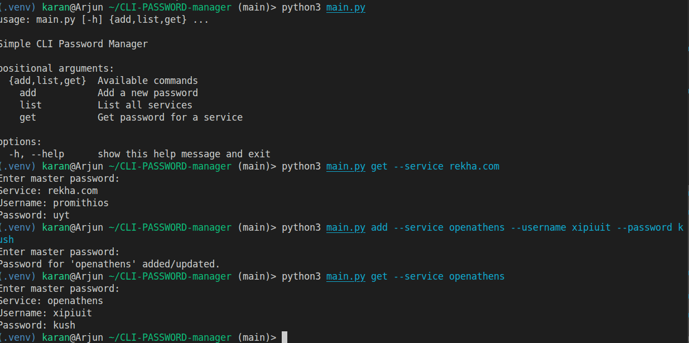

# Simple CLI Password Manager



A secure tool for managing credentials, built for the **Btekians** team to manage event logistics and personal passwords safely.

## 🛠 Features
- **AES-256 Encryption:** Securely locks your data.
- **Screenshot Support:** Capture and encrypt visual data (like QR codes).
- **Zero-Knowledge:** Your master password is never stored.

## 🚀 Quick Start
1. **Clone the repo:**
   ```bash
   git clone https://github.com/tryst-kumar/CLI-PASSWORD-manager.git
